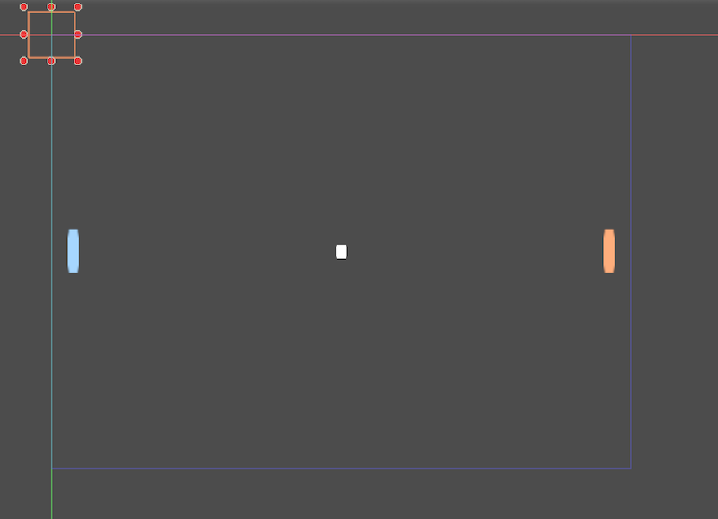

# Resources

A Resource represents a data container, everything that can be saved to a file is a Resource. It's a datatype, which means we can set a resource as a property of a Node object.

Resources can be **external**, which means they're stored in a separated file. Resources that are stored within the same scene file are called **built-in**.

## The Reference Object

Resources extend from an Object called Reference, when a Resource is no longer used, it frees itself; that is, when the Node referencing the given Resource is removed.

## Exercise 2

- On the scene of the previous exercise, assign the square.tex resource as the Texture property of the Sprites.
- Scale and arrange them so the scene looks like this (familiar?):


## Exercise 2b 

- Remove the Texture property from the ball Node and add the following script to it.

```
func _ready():

	var res = load("res://assets/squared.png") # resource is loaded when line is executed
	set_texture(res) 
	
```

- Save the script as an external resource.
