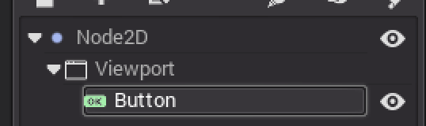
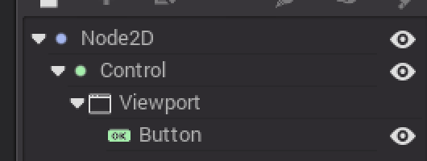
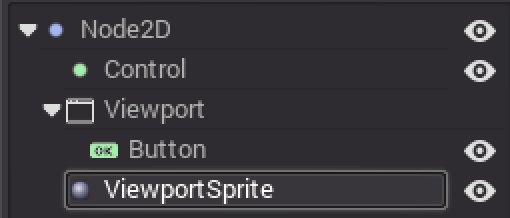

# Viewports

A Viewport is a type of Node which represents a rectangle where a world can be drawn. Their behavior is as follows:

- Input data is calculated relative to the nearest parent Viewport
- Cameras always render to the nearest parent Viewport
- There can be only one active camera per Viewport

The root Node is always a Viewport.

## Worlds

In 3D, a Viewport will contain a World, which has a set of parameters for rendering and physics. Spatial Nodes will register using the parameters of the World of the closest parent Viewport. You could use a child Viewport for isolating Objects from interacting with the Objects of the parent Viewport. 

## Sub-Viewports

If a Viewport is a child of a Control, it becomes active and display everything that's inside.

## Exercise 3

1. Open a new Scene and generate the following tree:

3. Play
4. Now make a Control and reparent the Viewport to it

5. Play again
6. Take the viewport off the Control
7. Add a Viewport Sprite

8. Set the viewport property to our Viewport
9. Enable "render target" in our Viewport's properties

