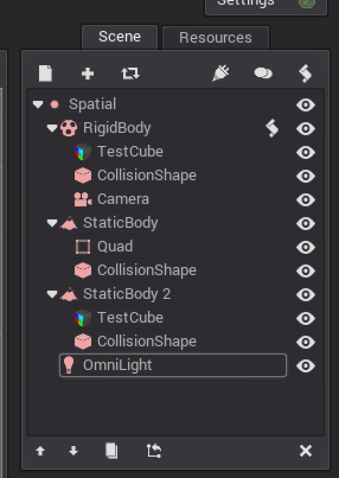
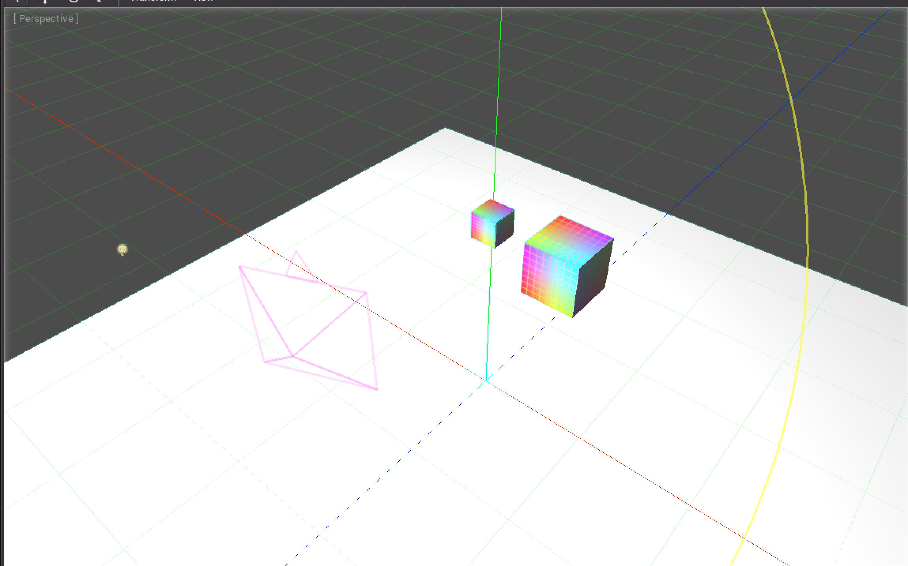

# Creating a 3D Scene 

Along these lessons, I'm sure you've seen that there are way too many types of Nodes. We've seen the basics of how to work with Godot, now we can put it to practice with some help of the documentation tab.

In the documentation tab, you can look for reference of Classes, methods, constants and so on, getting familiar with it is very important for accomplishing more complex projects.

## Excercise 12

- Make The following node tree:



- Arrange the Nodes according to the following:
	- The CollisionShape on the RigidBody should match the TestCube's position and size.
	- The Camera should look at the TestCube on the RigidBody.
	- The StaticBody is the floor and should be flat under everything else and big enough to move around it.
	- StaticBody 2 should be nearly twice the size of the RigidBody's TestCube.

- Add the key actions to the RigidBody to move around, we will reuse the actions set on our pong example.
```
func _input(ev):
	if(ev.type == InputEvent.KEY):
		if(ev.is_action('right_up')):
			set_linear_velocity(Vector3(0, 0, -3))
		elif(ev.is_action('right_down')):
			set_linear_velocity(Vector3(0, 0, 3))
```
- Remember that you should extend from a class and activate input processing ;)
